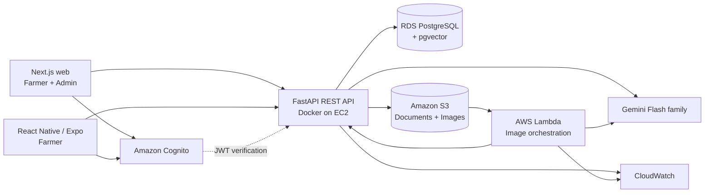

# System architecture

## Logical architecture



Web and mobile share one API and domain model. The backend begins as a modular monolith on EC2; Lambda is reserved for asynchronous image-analysis orchestration.

## Text-query flow

```mermaid
sequenceDiagram
  participant U as Farmer
  participant UI as Web/Mobile
  participant API as FastAPI
  participant DB as PostgreSQL/pgvector
  participant AI as Gemini Flash
  U->>UI: Ask in mr/hi/en
  UI->>API: Authenticated query
  API->>API: Validate, classify, route
  API->>DB: Metadata + vector/text retrieval
  DB-->>API: Approved evidence
  alt sufficient applicable evidence
    API->>AI: Query + bounded evidence + output contract
    AI-->>API: Grounded localized draft
    API->>API: Validate citations and safety rules
    API->>DB: Messages, retrieval metadata, citations
    API-->>UI: Answer + structured citations
  else insufficient evidence
    API->>DB: Store qualified/refusal response metadata
    API-->>UI: Explain limitation; no invented advice
  end
```

## Component responsibilities

- Clients: presentation, localization, basic validation, secure token use, and upload initiation; never hold privileged AWS credentials.
- Cognito: identity issuance; PostgreSQL stores only the Cognito subject and application profile, never passwords or OTPs.
- FastAPI: authorization, validation, domain logic, routing, retrieval, safety gates, citations, persistence, and signed upload coordination.
- PostgreSQL/pgvector: transactional application data, knowledge metadata, embeddings, text search, and provenance.
- S3: immutable/versioned originals and restricted uploaded images.
- Lambda: image job orchestration, validation/processing coordination, and callback/result handoff—not the entire backend.
- Gemini: language understanding, visual observation, reasoning over supplied evidence, summarization, translation, and formatting; not source of truth.

## Trust boundaries

All client input, uploaded content, model output, and retrieved document text is untrusted. Approved-source status and document-version status control eligibility for retrieval. Generated citations must resolve to evidence actually supplied for that response.

## Key assumptions

- API base path will be `/api/v1`.
- Long-running image work is asynchronous.
- Hybrid retrieval combines pgvector similarity with PostgreSQL full-text search and metadata filters.
- Quantitative thresholds, queueing needs, and exact model identifiers are deferred until measured/verified.
