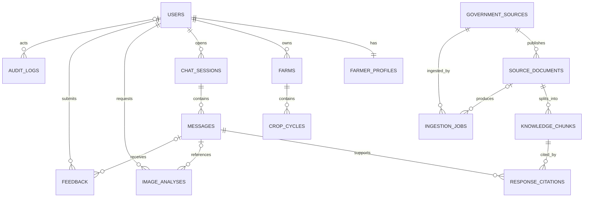

# Conceptual database design

No migrations or production tables are created in Phase 0. UUID primary keys are preferred; all mutable records have `created_at` and `updated_at` in UTC unless noted. Soft-disable/status fields preserve auditability.

## Relationships

## Entity catalog

| Entity | Purpose and important fields | Foreign keys / constraints | Sensitive / retention | Useful indexes |
|---|---|---|---|---|
| `users` | App identity: `id`, `cognito_sub`, `role`, `status`, `preferred_language`, `last_login_at` | unique `cognito_sub`; role in farmer/admin; language in mr/hi/en | identifier; retain while account active plus deletion/audit policy | unique subject; role/status |
| `farmer_profiles` | `user_id`, name, state, district, taluka, optional village | unique FK user; farmer role | PII; delete/anonymize with account per approved policy | district/taluka only if operationally needed |
| `farms` | owner, label, acreage, irrigation type, general location, optional soil summary | FK user; acreage positive; no precise GPS required | potentially sensitive livelihood/location data | owner; region |
| `crop_cycles` | farm, crop=`tur`, variety, sowing date, stage, status | FK farm; valid dates/status | agronomic profile; retain with farm unless user deletion applies | farm/status; sowing date |
| `chat_sessions` | user, title, language, status | FK user | user content container | user/updated_at |
| `messages` | session, role, content, language, status, intent, model/config version, correlation ID | FK session; role user/assistant/system; ordered timestamp | chat may contain PII; configurable retention | session/created_at; correlation ID |
| `government_sources` | organization, source group, authority/trust status, access class, canonical reference, enabled | unique normalized identity; six approved groups initially | keep indefinitely for provenance | enabled/group |
| `source_documents` | source, title, canonical URL/ref, S3 object/version, checksum, language, geography, published/updated/effective dates, version, status | FK source; unique source+checksum/version; status controls retrieval | original artifacts retained per source/version policy | source/status; dates; crop/topic metadata |
| `knowledge_chunks` | document, ordinal, text, embedding, embedding model/version, page/section, crop/topic/region/stage/regulatory metadata | FK document; unique document+version+ordinal; embedding dimension fixed by chosen model | derived official material | vector ANN after measurement; GIN text; metadata composites |
| `response_citations` | assistant message, chunk, document snapshot fields, rank/score, retrieval time, displayed excerpt/reference | FK message/chunk/document; message must be assistant | retain at least as long as response | message; chunk; retrieval time |
| `image_analyses` | user, optional originating message/crop cycle, S3 key/version, status, visual observations JSON, evidence-backed interpretation, confidence/limitations, model/config versions | FK user/message/cycle; state machine; no guaranteed diagnosis field | image and derived health-like crop data; short configurable image retention | user/created_at; status; message |
| `feedback` | user, optional message/image/session, rating, category, comments, resolution status | at least one target; rating bounded | comments may contain PII | target IDs; status |
| `ingestion_jobs` | source, optional document, trigger type, status, started/completed times, counts, error code/summary, version/correlation ID | FK source/document; idempotency key unique | operational; purge detailed logs on schedule, retain summary | status/created_at; source; idempotency key |
| `audit_logs` | actor, action, resource type/id, timestamp, outcome, request ID, safe metadata | append-only; actor nullable for system | never store secrets/raw tokens; retention TBD | timestamp; actor; resource; request ID |
| `response_flags` | response message, rule/category, severity, status, reviewer, resolution | FK message/reviewer; controlled statuses | moderation/audit data | status/severity; message |

## Provenance invariants

1. A citation references an assistant message and the exact chunk/document version retrieved.
2. Snapshot fields preserve displayable provenance if a source later changes.
3. Disabled/superseded documents remain auditable but are excluded from new retrieval.
4. No assistant factual claim is considered grounded merely because a URL appears in generated text.
5. Cognito passwords, OTPs, raw JWTs, and secret keys are never stored.

## Retention baseline

Exact durations require product/legal review. Account/profile/farm data persists while needed for the account; chats and feedback are user-controllable and policy-bound; original uploaded images should have the shortest practical configurable lifetime; derived analysis/citations may outlive the binary only if disclosed; operational logs use shorter rolling retention; audit/provenance records use a longer controlled period. Deletion must account for backups and required security/audit evidence without making unsupported compliance claims.
