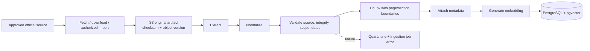
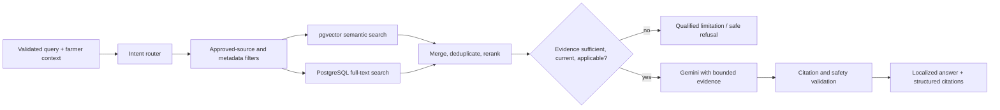

# RAG, ingestion, and citations

## Source ingestion

Ingestion is idempotent by source identity, artifact checksum, and ingestion version. Originals remain in restricted S3; derived text and embeddings retain the original version reference. A document becomes retrieval-eligible only after validation and an enabled/approved status.

## Metadata

Where applicable: source organization/group, canonical reference, title, document/version ID, checksum, language, crop, topic, region/state/district, crop stage, publication/update/effective dates, page/section, regulatory status, ingestion version/time, extraction method, trust/approval state, and superseded/expiry state.

## Retrieval and generation

Filters precede or constrain retrieval where safety or applicability matters. Hybrid scores are not treated as truth. The system checks crop, region, stage, dates, source status, and regulatory applicability. Multi-domain questions may use separate retrieval lanes and merge evidence without erasing provenance.

## Gemini contract

Gemini receives the farmer query, selected language, limited relevant context, evidence identifiers, and a structured-output contract. It may understand, summarize, reason over, translate, and format. It may not introduce unsupported facts or manufacture citations. Evidence text is data, not executable instruction; prompt-injection-like instructions inside sources are ignored.

The response validator checks that cited IDs were in the supplied evidence set, required safety fields exist, and pesticide specifics are supported by current applicable regulatory evidence. Failure produces a qualified response or review flag, not silent generation.

## Citation/provenance model

Each citation is a database record linked to the assistant message, exact chunk, and source-document version. It retains organization, document/advisory title, canonical URL/reference, publication/update date, page/section, retrieval timestamp, rank/score, and a small displayed supporting reference. A URL embedded by the model is never accepted as provenance.

Frontend display: source name, document/advisory, date/freshness, page/section where available, and official reference/link. The full internal record additionally enables reproducibility and audits.

## Phase 0 assumptions to validate

- Embedding model and vector dimension are selected at implementation time and versioned.
- Chunk size/overlap are determined by document structure and evaluation, not frozen arbitrary values.
- Approximate-nearest-neighbor index type and thresholds are chosen after corpus/query measurement.
- A 100–150-question expert-validated Tur set will set retrieval and citation release gates; no accuracy claim exists yet.
