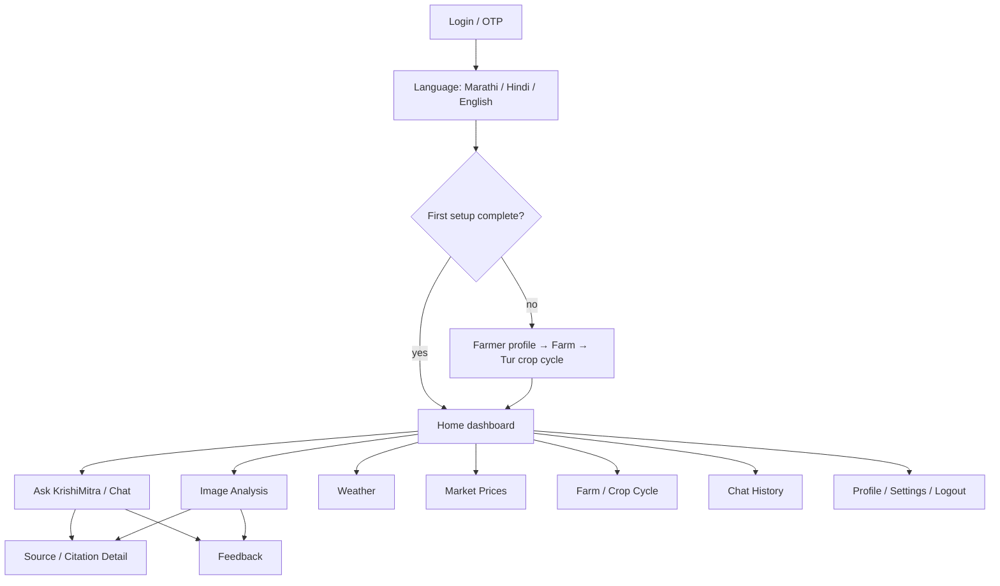

# Web and mobile information architecture

## Shared farmer journey

Shared web/mobile behavior includes authentication, setup, dashboard, chat/history, upload, analysis results, weather, market, citations, profile/farm/cycle, feedback, and settings. Mobile uniquely provides native camera capture and associated permission/error states. Web provides responsive file selection; it may use device capture when browser-supported but does not define the native contract.

## Screen responsibilities

- Login/OTP: initiate supported Cognito flow, verify state, resend throttling, error/accessibility states.
- Language: select UI and response language; changeable later.
- Initial setup: minimal profile, general location, farm, and Tur cycle; optional fields clearly marked.
- Dashboard: current cycle context, freshness-aware weather/market summaries, primary chat/image actions.
- Chat: text input, loading/cancel/error, grounded answer, limitations, citation links.
- Image analysis: capture/select, consent and quality guidance, upload/progress/status, observations separated from interpretation/guidance.
- Weather/market: source, observation/update/retrieval timestamps, filters, unavailable/stale states.
- History: sessions, messages, citations; later deletion behavior must follow retention policy.
- Citation detail: organization, document/advisory, publication date, page/section, official reference.
- Feedback: target-specific rating/category/comment, no promise that feedback trains models automatically.

## Admin web map

Admin Login → Dashboard → Government Sources → Source Documents → Ingestion Status / Failed Jobs → Feedback → Flagged Responses → User/System Overview → Logs/Health Summary.

Admin functions are web-only for V1 and use protected routes plus API role enforcement. The UI exposes safe operational summaries, not secrets or raw sensitive logs.

## Client architecture rules

- Next.js farmer/admin web and React Native/Expo farmer mobile consume shared typed REST contracts.
- Localization resources cover `mr`, `hi`, and `en`; layouts tolerate text expansion and appropriate fonts.
- Tokens use platform-appropriate secure handling; privileged credentials never ship to clients.
- Basic client validation improves UX, but server validation and authorization remain authoritative.
- Offline behavior is limited to safe cached UI/data if added later; stale agricultural guidance must be visibly labeled.
