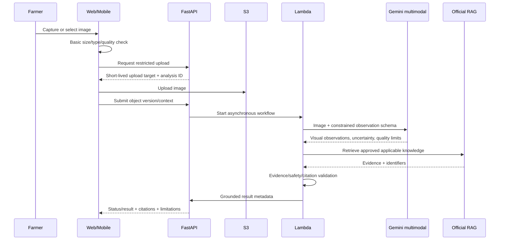

# Image-analysis design

## Frozen workflow

## Output contract

The result separates:

1. `visual_observations`: visible color, shape, distribution, affected plant part, image-quality limitations; no disease certainty.
2. `possible_interpretations`: evidence-backed possibilities with uncertainty and alternatives.
3. `recommended_next_steps`: low-risk actions, requested additional evidence, or expert escalation.
4. `chemical_guidance`: absent unless current applicable official regulatory evidence supports every material detail.
5. `citations`, `limitations`, model/config version, and timestamps.

The UI must say “possible” or equivalent where appropriate and must never label a visual result as guaranteed diagnosis.

## Validation and state model

Client checks extension/declared type, size, and obvious capture quality. Server/S3 workflow independently checks actual format/decode, byte/pixel limits, checksum/object version, ownership, and safe key. States: `created → uploaded → queued → observing → retrieving → validating → completed`, with terminal `failed`, `rejected`, or `expired`. Retries are bounded and idempotent.

## Safety rules

- Gemini cannot independently invent pesticide name, dosage, rate, waiting period, or unsafe chemical action.
- Missing, stale, conflicting, or geographically/crop-inapplicable evidence yields a limitation/escalation.
- Low image quality, insufficient context, or ambiguous symptoms prompts safer recapture/context instructions.
- Relevant farm/crop-stage context is user-provided or stored; it is not inferred as fact from the image.
- Original image access is private and time-limited. Retention is configurable and disclosed.

## Open verification

Exact Gemini Flash model/schema, Lambda timeout/memory/event mechanism, malware/content inspection method, supported file types/limits, confidence presentation, agronomist review criteria, and deletion duration are finalized in Phase 5 after testing—not claimed in Phase 0.
