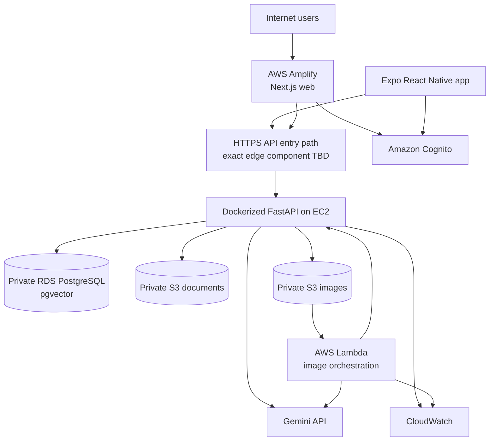

# AWS deployment architecture

## Intended deployment

The precise public API ingress/load-balancing and asynchronous event mechanism are Phase 1/5 decisions based on cost, TLS, reliability, and scale; Phase 0 does not invent infrastructure that was not frozen.

## Service responsibilities

- Amplify: build/host responsive Next.js web and environment-specific public configuration.
- EC2: run the Docker-compatible FastAPI modular monolith; no direct database exposure.
- RDS PostgreSQL: transactional data, full-text search, and pgvector; private subnets/restricted security groups, encryption/backups configured before production.
- S3: separate private buckets/prefixes for versioned official artifacts and user images; block public access, encryption, lifecycle rules.
- Cognito: farmer/admin identities and tokens; administrator group/claims.
- Lambda: bounded image-analysis orchestration; not general API hosting.
- CloudWatch: application/Lambda logs, metrics, alarms, and dashboards without sensitive payloads.
- IAM and secrets: role-based access; least privilege; Gemini/database secrets in an AWS-compatible managed strategy, not Git.

## Network and operational baseline

- Only the HTTPS API ingress is public; RDS is not publicly accessible.
- Security groups allow only necessary service-to-service paths.
- Egress to Gemini and verified external sources is controlled and monitored where practical.
- Environment separation is required; names/account strategy finalized in Phase 1.
- Health checks, deployment rollback, backup/restore, patching, capacity, budget alarms, and incident runbooks are required before production.

## Phase 0 boundary

No account, VPC, subnet, bucket, instance, database, Cognito pool, Lambda, IAM role, DNS record, certificate, secret, alarm, or deployment has been created.
