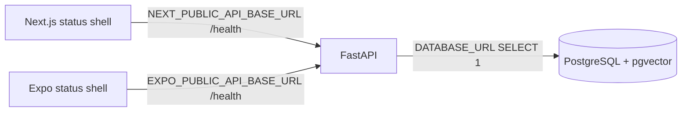

# Phase 1 development setup

## Foundation scope

Phase 1 adds executable shells and infrastructure foundations only: responsive status web, Expo status mobile, FastAPI health/readiness, local PostgreSQL/pgvector, Docker, quality checks, CI, and AWS development foundations. There are no user-domain APIs, migrations, authentication flows, Gemini calls, RAG, ingestion, or final screens.

## Connectivity

Web and mobile show `checking`, `connected`, or `offline`. Backend `/health` reports process health. `/api/v1/ready` performs a database query. S3 connectivity is an infrastructure verification only; no upload API exists.

## Commands

Use the root README for exact startup and quality commands. The supported CI runtimes are Node 22 and Python 3.13 even if a developer workstation has newer versions.

## Responsive baseline

The web shell uses a fluid single-column layout, a 320 px minimum, responsive type/padding, semantic heading/status elements, visible contrast, and a phone-specific rule below 480 px. Sanity-check representative widths at 375, 768, 1366, and 1920 px. This is a foundation, not final UX.

## Configuration

`.env.example` is a catalog only. Browser-visible variables carry only public URLs. Server secrets are supplied at runtime from ignored local files or a managed AWS secret/parameter strategy. EC2/Lambda use IAM roles instead of embedded access keys.

## Physical-device networking

An Expo app on a phone cannot reach the developer PC through `localhost`. Set `EXPO_PUBLIC_API_BASE_URL` to an HTTP(S) address reachable from that device, commonly the host's LAN address during controlled local development. Production must use HTTPS. Do not open database ports or broad cloud security-group rules to solve client connectivity.
