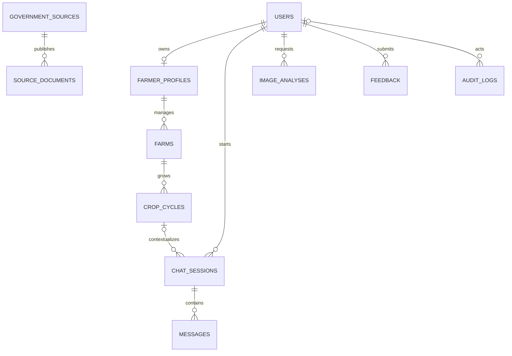

# Phase 2 database

PostgreSQL is the source of truth and Alembic is the only schema-change mechanism. The initial revision is `20261007_0001`; it enables pgvector and creates the 11 core tables below. UUID primary keys and timezone-aware timestamps are used throughout. Foreign keys default to restrictive deletion, with `SET NULL` only where retaining the dependent record is intentional.



Constraints enforce positive farm area, Tur/Pigeonpea-only crop cycles, harvest dates not preceding sowing, feedback ratings from 1–5, unique Cognito subjects, and indexed ownership/lookup paths. Six government organizations are seeded as approved metadata only; no invented documents, URLs, or agricultural claims are included.

Local migration validation:

```bash
docker compose exec backend alembic downgrade base
docker compose exec backend alembic upgrade head
docker compose exec backend python -m scripts.seed_government_sources
```

For RDS, provide the Secrets Manager ARN and endpoint to `python -m scripts.migrate_rds`. It reads the managed secret at runtime, URL-encodes credentials, runs Alembic, clears the generated URL, and never prints the password. Backups, point-in-time recovery, and restore drills remain infrastructure operations; destructive schema changes require an explicit backup and reviewed migration.
