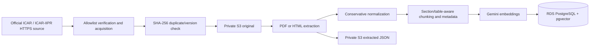

# Phase 3 ingestion pipeline



The implementation is split across acquisition, extraction, normalization, taxonomy, chunking, storage, embedding, and orchestration modules. It intentionally does not contain a Gemini Flash answer-generation call.

## Extraction and numeric integrity

Text PDFs are extracted per page with `pypdf`. A PDF with no extractable text fails and is marked for OCR review; OCR is not silently attempted. HTML extraction removes scripts, styles, forms, navigation and footer material. Tables become pipe-delimited rows so headers remain associated with values.

Normalization removes null bytes, non-breaking spaces and redundant whitespace. It does not summarize, translate, correct, convert units, or rewrite agricultural recommendations. Tests explicitly preserve examples such as `20 kg/ha`, `25 DAS`, `120 x 60 cm`, and `0.1%`.

## Chunking and metadata

The V1 target is roughly 600 whitespace-delimited words with a 75-word overlap. Section changes and logical tables take priority over size. Each chunk receives a deterministic SHA-256, page range where available, section, language, canonical crop `PIGEONPEA`, controlled topic, ingestion version, and a regulatory-validation flag when pesticide-related evidence is detected.

Supported aliases are Tur, Toor, Arhar, Pigeonpea, Pigeon pea, Red gram, and the scientific name. Other crops are rejected.

## Embeddings

The configured model is `gemini-embedding-2` at 768 dimensions. As verified on 2026-10-07, Google documents it as a stable Gemini embedding model with flexible 128–3072 dimensions and recommends 768, 1536, or 3072. Dimension 768 is fixed in the Phase 3 migration and validated for every batch; the model identifier remains configurable. Document and query prompts use retrieval-specific instructions because Gemini Embedding 2 does not use the older `task_type` parameter.

Embedding calls use bounded exponential backoff, never log credentials, and fail the job if count or dimension differs. Normal CI uses deterministic fakes. Local live ingestion can use `GEMINI_API_KEY` from an untracked environment file; AWS can instead use `GEMINI_SECRET_ARN`, restricted by IAM to the exact secret ARN. The secret may contain a raw key or JSON with `api_key`/`GEMINI_API_KEY` and is cached only in process memory.

## Controlled command

From `backend`:

```bash
python -m app.ingestion.cli --inventory ../data/sources/phase3-icar-pigeonpea.json --dry-run
python -m app.ingestion.cli --inventory ../data/sources/phase3-icar-pigeonpea.json
python -m app.ingestion.cli --inventory ../data/sources/phase3-icar-pigeonpea.json --retry
```

Jobs truthfully transition through `FETCHING`, `PROCESSING`, `EMBEDDING`, and `COMPLETED`; failures end as `FAILED`. Incomplete chunks are never activated.

## Current live-ingestion status

The deterministic pipeline, migrations, AWS permissions and source audit are verified. Four ICAR-IIPR inputs were ingested with real Gemini embeddings on 2026-10-08, producing 23 active chunks. A complete repeat produced four duplicate results and no duplicate active knowledge.
