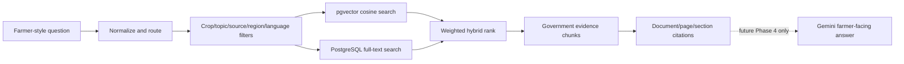

# Phase 3 RAG retrieval

`RetrievalService.retrieve_evidence` is the Phase 4 boundary. It accepts a question, canonical crop context, optional topic/source/region/language filters and a bounded limit. It returns evidence, vector and lexical ranking data, citation metadata, and a sufficiency state—not an answer or a fabricated confidence percentage.

Semantic ranking uses cosine distance over `vector(768)` with an HNSW `vector_cosine_ops` index. Lexical ranking uses a stored English `tsvector` and GIN index. The default combined score is 65% vector similarity and 35% bounded lexical rank; weights, limits and minimum relevance are environment-configurable.

Retrieval always excludes inactive chunks/documents/sources, failed documents, and non-approved sources. Explicit unsupported domains such as live weather, live markets and other crops produce `OUT_OF_SCOPE`. Weak rankings below the configured threshold produce `INSUFFICIENT_EVIDENCE`.

## APIs

- `POST /api/v1/knowledge/search` — authenticated internal retrieval test/future Phase 4 endpoint.
- `GET /api/v1/sources` — authenticated safe public metadata for approved active sources.
- `GET /api/v1/sources/{source_id}` — authenticated safe document metadata; no private S3 location.

The search API does not expose vectors, credentials, internal bucket keys, or final Gemini-generated guidance.
