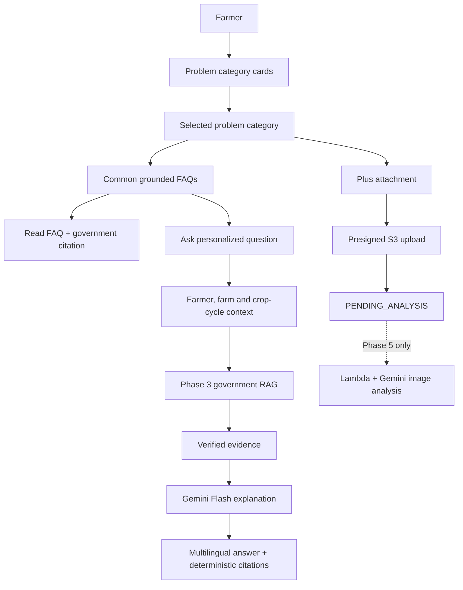

# Phase 4 guided assistance

Phase 4 implements a problem-discovery-first experience: authenticated farmers choose one of 14 Tur problem categories, inspect grounded FAQs, and then optionally ask a personalized question inside that context. It does not create a free-form chatbot home screen.

`chat_sessions` remains the conversation record and now carries `problem_category_id`, optional `selected_faq_id`, and `origin_type`. The actual question is the primary intent signal; the selected category is context and is never allowed to override a clear mismatch. The service retains the six most recent messages for follow-ups.

The new endpoints are `POST /api/v1/assistance/sessions` and `POST /api/v1/assistance/sessions/{id}/questions`. Both enforce the existing Cognito farmer role and ownership model.
